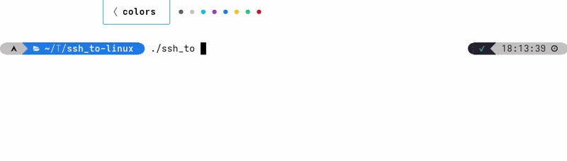

# ssh_to

A program written in rust that lists your machines and allows you to connect to any of them via SSH.



# How to use

## First launch

First, run the program. It will display the location of the configuration file:

```text
Config path: ~/.config/ssh-manager/machines.toml
```

Open this file with a text editor such as `nano`:

```bash
nano ~/.config/ssh-manager/machines.toml
```

Then add your machines using the TOML format.

## Configuration file

The configuration file contains a list of machines.

Each machine requires:

* `name`: The name of the machine
* `user`: The SSH username
* `ip`: The IP address or hostname of the machine

Example:

```toml
[[machine]]
name = "Home Server"
user = "admin"
ip = "192.168.1.50"

[[machine]]
name = "Raspberry Pi"
user = "pi"
ip = "raspberrypi.local"

[[machine]]
name = "VPS"
user = "root"
ip = "example.com"
```

Save the file and run the program again.

# Connecting to a machine

`ssh_to` will display all configured machines:

```text
Your machines:
1: Home Server as admin @ 192.168.1.50
2: Raspberry Pi as pi @ raspberrypi.local
3: VPS as root @ example.com
```

Enter the number of the machine you want to connect to:

```text
1
```

The program will automatically start the SSH connection:

```text
Connecting to Home Server (192.168.1.50)...
```

# Requirements

* SSH must be installed on your system.
* You need SSH access to the target machines.
* Your SSH keys or passwords must be correctly configured.

# Installation

## From release

Go to the release page and download the file for your system (Windows, macOS, or Linux).

Extract the archive and run the program.

## From source

Clone the repository:

```bash
git clone https://github.com/SuperAtraction/ssh_to.git
cd ssh_to
```

Build the program:

```bash
cargo build --release
```

Run it:

```bash
cargo run --release
```

# Features

* Simple machine management using a TOML configuration file
* Automatic configuration file creation
* List all available machines
* Connect directly through SSH
* Cross-platform support
